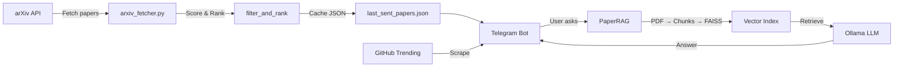
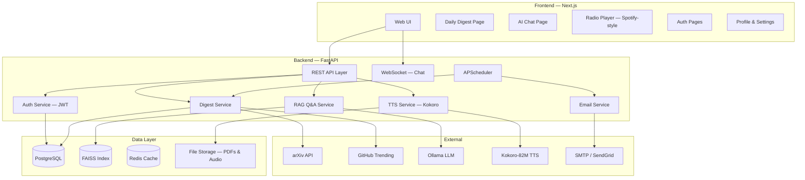
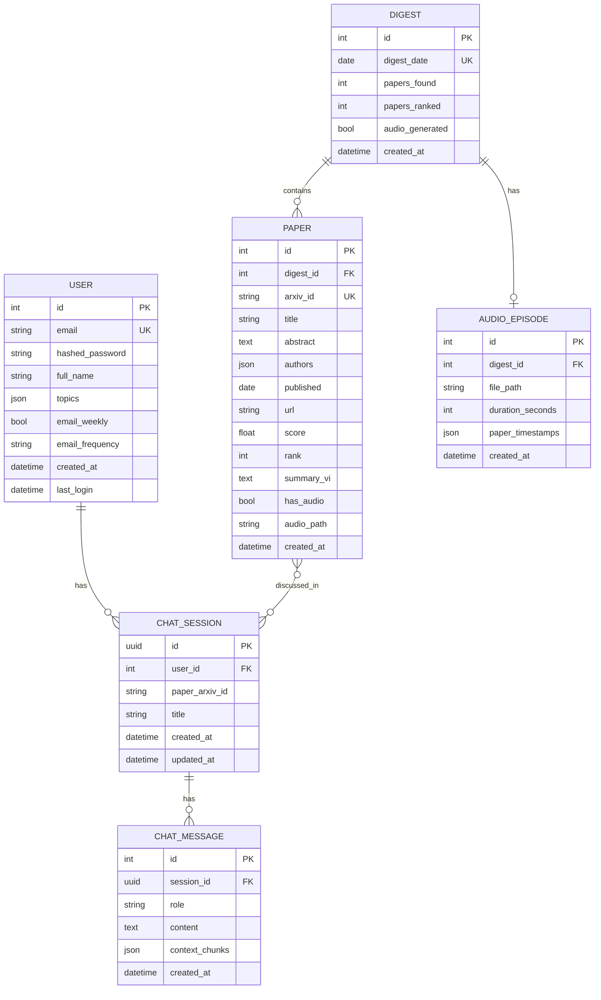

# 🚀 AI Research News — Web Application Platform

> Chuyển đổi hệ thống Daily Paper Brief Bot (Telegram) thành một Web Platform hoàn chỉnh với AI Chat, TTS Radio News, và Weekly Email Newsletter.

---

## 📊 Phân Tích Hệ Thống Hiện Tại

### Kiến trúc hiện có

Hệ thống hiện tại là một **Python CLI application** chạy trên máy tính cá nhân, giao tiếp qua Telegram Bot API:



### Các module core đang có

| Module | File | Chức năng |
|--------|------|-----------|
| **Config** | [config.py](file:///c:/Users/Admin/OneDrive/Máy tính/TTCS/UpToDate/TTCS/app/core/config.py) | Load `.env`, cấu hình Ollama, Telegram, topics, scheduler |
| **RAG Engine** | [rag.py](file:///c:/Users/Admin/OneDrive/Máy tính/TTCS/UpToDate/TTCS/app/core/rag.py) | PDF download → section-aware chunking → FAISS index → MMR retrieval |
| **Bot Handler** | [bot_handler.py](file:///c:/Users/Admin/OneDrive/Máy tính/TTCS/UpToDate/TTCS/app/services/bot_handler.py) | Xử lý commands `/start`, `/paper1..5`, `/up`, Q&A sessions |
| **Telegram Utils** | [telegram_utils.py](file:///c:/Users/Admin/OneDrive/Máy tính/TTCS/UpToDate/TTCS/app/services/telegram_utils.py) | Send messages, Ollama query, HTML formatting |
| **ArXiv Fetcher** | [arxiv_fetcher.py](file:///c:/Users/Admin/OneDrive/Máy tính/TTCS/UpToDate/TTCS/app/tasks/arxiv_fetcher.py) | Fetch arXiv API → filter/rank → format digest |
| **GitHub Trending** | [github_trending.py](file:///c:/Users/Admin/OneDrive/Máy tính/TTCS/TTCS-main/app/tasks/github_trending.py) | Scrape GitHub trending → filter AI repos |
| **Main** | [main.py](file:///c:/Users/Admin/OneDrive/Máy tính/TTCS/UpToDate/TTCS/app/main.py) | Entry point: Telegram polling + daily scheduler |

### Những gì tái sử dụng được

- ✅ **RAG Pipeline** (`PaperRAG`): Logic PDF → chunk → FAISS hoàn chỉnh, chỉ cần wrap thành API
- ✅ **ArXiv Fetcher**: Logic fetch + filter + rank papers hoàn chỉnh
- ✅ **GitHub Trending**: Scraper hoạt động tốt
- ✅ **Ollama Integration**: Query LLM đã ổn định
- ❌ **Telegram-specific code**: Cần thay bằng WebSocket/REST API
- ❌ **Session management**: Cần chuyển sang database-backed sessions
- ❌ **Không có user authentication**: Cần xây mới hoàn toàn

---

## 🏗️ Kiến Trúc Mới — Full-Stack Web Application



---

## User Review Required

> [!IMPORTANT]
> **Lựa chọn LLM Backend**: Hệ thống hiện tại dùng **Ollama chạy local** (qwen3.5:4b). Với web app phục vụ nhiều user, bạn có muốn:
> - (A) Giữ Ollama local (phù hợp demo/nội bộ, giới hạn concurrent users)
> - (B) Chuyển sang Cloud API (OpenAI, Google Gemini) cho production scale
> - (C) Hỗ trợ cả hai, configurable qua env

> [!IMPORTANT]
> **Database choice**: Plan đề xuất PostgreSQL cho production. Nếu muốn đơn giản hơn cho MVP, có thể dùng SQLite. Bạn muốn option nào?

> [!IMPORTANT]
> **Hosting/Deployment**: Bạn định deploy ở đâu? (VPS tự quản lý, Vercel + Railway, Docker Compose local, v.v.)

> [!WARNING]
> **TTS Resource**: Kokoro-82M chạy trên CPU mất ~2-5 giây cho mỗi đoạn text ngắn. Với bản tin dài 5 papers, thời gian tổng hợp audio có thể mất 1-3 phút. Audio nên được **pre-generate** khi có digest mới, không nên generate on-demand.

---

## Open Questions

> [!IMPORTANT]
> 1. **Ngôn ngữ TTS**: Bản tin đọc bằng tiếng Việt hay tiếng Anh? Kokoro hỗ trợ tốt tiếng Anh, tiếng Việt cần model khác (VietTTS/VITS).
> 2. **Scope người dùng**: Web app này cho cá nhân bạn hay công khai cho nhiều người dùng đăng ký?
> 3. **Email provider**: Bạn có tài khoản SendGrid/Mailgun hay muốn dùng Gmail SMTP?
> 4. **Telegram Bot**: Giữ Telegram Bot song song với web app hay thay thế hoàn toàn?

---

## Proposed Changes

### Cấu trúc thư mục dự án mới

```
TTCS/
├── backend/                          # FastAPI Python Backend
│   ├── app/
│   │   ├── __init__.py
│   │   ├── main.py                   # FastAPI app entry + CORS + lifespan
│   │   ├── config.py                 # Pydantic Settings
│   │   ├── database.py               # SQLAlchemy / async engine
│   │   │
│   │   ├── models/                   # SQLAlchemy ORM models
│   │   │   ├── user.py               # User, email preferences
│   │   │   ├── paper.py              # Paper, digest records
│   │   │   ├── chat.py               # Chat sessions, messages
│   │   │   └── audio.py              # TTS audio cache records
│   │   │
│   │   ├── schemas/                  # Pydantic request/response schemas
│   │   │   ├── auth.py
│   │   │   ├── paper.py
│   │   │   ├── chat.py
│   │   │   └── audio.py
│   │   │
│   │   ├── routers/                  # API route handlers
│   │   │   ├── auth.py               # /api/auth/*
│   │   │   ├── digest.py             # /api/digest/*
│   │   │   ├── chat.py               # /api/chat/* + WebSocket
│   │   │   ├── audio.py              # /api/audio/*
│   │   │   └── user.py               # /api/user/*
│   │   │
│   │   ├── services/                 # Business logic
│   │   │   ├── arxiv_service.py      # ← Refactor từ arxiv_fetcher.py
│   │   │   ├── github_service.py     # ← Refactor từ github_trending.py
│   │   │   ├── rag_service.py        # ← Refactor từ rag.py
│   │   │   ├── llm_service.py        # ← Refactor từ telegram_utils.query_ollama
│   │   │   ├── tts_service.py        # [NEW] Kokoro TTS integration
│   │   │   ├── email_service.py      # [NEW] Email newsletter
│   │   │   └── digest_service.py     # [NEW] Orchestrate daily digest
│   │   │
│   │   ├── tasks/                    # Background scheduled tasks
│   │   │   ├── scheduler.py          # APScheduler setup
│   │   │   ├── daily_digest.py       # Daily paper fetch + TTS generate
│   │   │   └── weekly_email.py       # Weekly newsletter dispatch
│   │   │
│   │   └── core/                     # Shared utilities
│   │       ├── security.py           # JWT, password hashing
│   │       ├── dependencies.py       # FastAPI dependencies
│   │       └── exceptions.py         # Custom exceptions
│   │
│   ├── alembic/                      # DB migrations
│   ├── data/                         # Papers, indices, audio files
│   ├── templates/                    # Email HTML templates (Jinja2)
│   ├── requirements.txt
│   ├── alembic.ini
│   └── .env
│
├── frontend/                         # Next.js Frontend
│   ├── src/
│   │   ├── app/                      # App Router pages
│   │   │   ├── layout.tsx            # Root layout + fonts + theme
│   │   │   ├── page.tsx              # Landing / Home
│   │   │   ├── login/page.tsx
│   │   │   ├── register/page.tsx
│   │   │   ├── digest/
│   │   │   │   ├── page.tsx          # Daily digest feed
│   │   │   │   └── [id]/page.tsx     # Single paper detail
│   │   │   ├── chat/
│   │   │   │   └── page.tsx          # AI Chat interface
│   │   │   ├── radio/
│   │   │   │   └── page.tsx          # Radio/podcast player
│   │   │   └── settings/
│   │   │       └── page.tsx          # User preferences
│   │   │
│   │   ├── components/
│   │   │   ├── layout/
│   │   │   │   ├── Navbar.tsx
│   │   │   │   ├── Sidebar.tsx
│   │   │   │   └── Footer.tsx
│   │   │   ├── digest/
│   │   │   │   ├── PaperCard.tsx
│   │   │   │   ├── DigestTimeline.tsx
│   │   │   │   └── PaperDetail.tsx
│   │   │   ├── chat/
│   │   │   │   ├── ChatWindow.tsx
│   │   │   │   ├── MessageBubble.tsx
│   │   │   │   ├── PaperSelector.tsx
│   │   │   │   └── ChatInput.tsx
│   │   │   ├── radio/
│   │   │   │   ├── RadioPlayer.tsx   # Spotify-style player
│   │   │   │   ├── Playlist.tsx
│   │   │   │   ├── WaveformViz.tsx
│   │   │   │   └── MiniPlayer.tsx    # Sticky bottom player
│   │   │   ├── auth/
│   │   │   │   ├── LoginForm.tsx
│   │   │   │   └── RegisterForm.tsx
│   │   │   └── ui/                   # Shared UI components
│   │   │       ├── Button.tsx
│   │   │       ├── Input.tsx
│   │   │       ├── Modal.tsx
│   │   │       ├── Skeleton.tsx
│   │   │       └── Toast.tsx
│   │   │
│   │   ├── lib/
│   │   │   ├── api.ts               # Centralized API client (fetch wrapper)
│   │   │   ├── ws.ts                # WebSocket client for chat
│   │   │   ├── auth.ts              # Auth helpers (token management)
│   │   │   └── utils.ts
│   │   │
│   │   ├── hooks/
│   │   │   ├── useAuth.ts
│   │   │   ├── useDigest.ts
│   │   │   ├── useChat.ts
│   │   │   └── useAudioPlayer.ts
│   │   │
│   │   └── styles/
│   │       └── globals.css           # Design system + variables
│   │
│   ├── public/
│   ├── next.config.ts
│   ├── package.json
│   └── tsconfig.json
│
└── docker-compose.yml                # Optional: PostgreSQL + Redis + App
```

---

### Module 1: Backend Foundation & Auth

#### [NEW] backend/app/main.py — FastAPI Application

FastAPI app với CORS, lifespan events (khởi tạo scheduler, DB connection), và mount all routers.

```python
# Key features:
# - CORS middleware cho Next.js frontend
# - Lifespan: init DB, start APScheduler, load Kokoro model
# - Mount routers: /api/auth, /api/digest, /api/chat, /api/audio, /api/user
```

#### [NEW] backend/app/config.py — Pydantic Settings

Thay thế `config.py` hiện tại bằng Pydantic `BaseSettings` cho type-safe config:

```python
class Settings(BaseSettings):
    # Database
    DATABASE_URL: str = "postgresql+asyncpg://..."
    
    # Auth
    SECRET_KEY: str
    ACCESS_TOKEN_EXPIRE_MINUTES: int = 30
    
    # Ollama
    OLLAMA_BASE_URL: str = "http://localhost:11434"
    OLLAMA_MODEL: str = "qwen3.5:4b"
    
    # TTS
    KOKORO_MODEL_PATH: str = "./models/kokoro"
    TTS_VOICE: str = "af_bella"
    TTS_OUTPUT_DIR: str = "./data/audio"
    
    # Email
    SMTP_HOST: str = "smtp.gmail.com"
    SMTP_PORT: int = 587
    SMTP_USER: str = ""
    SMTP_PASSWORD: str = ""
    
    # ArXiv
    TOPICS: str = "AI agents,RAG,multi-agent systems,LLM reasoning"
    SCHEDULE_TIME: str = "07:00"
    
    model_config = SettingsConfigDict(env_file=".env")
```

#### [NEW] backend/app/models/user.py — User Model

```python
class User(Base):
    id: int (PK)
    email: str (unique, indexed)
    hashed_password: str
    full_name: str
    topics: JSON            # Custom topic preferences
    email_weekly: bool      # Opt-in weekly newsletter
    email_frequency: str    # "weekly" | "daily"
    created_at: datetime
    last_login: datetime
```

#### [NEW] backend/app/routers/auth.py — Authentication

- `POST /api/auth/register` — Đăng ký (email + password)
- `POST /api/auth/login` — Login → JWT token (HTTP-only cookie)
- `POST /api/auth/logout` — Clear cookie
- `GET /api/auth/me` — Get current user info
- `PUT /api/auth/preferences` — Update topic preferences, email settings

#### [NEW] backend/app/core/security.py — JWT & Password

- `bcrypt` cho password hashing
- `python-jose` cho JWT encode/decode
- HTTP-only cookie storage cho security

---

### Module 2: Daily Digest — Bản tin tổng hợp

#### [REFACTOR] backend/app/services/arxiv_service.py

Refactor từ [arxiv_fetcher.py](file:///c:/Users/Admin/OneDrive/Máy tính/TTCS/UpToDate/TTCS/app/tasks/arxiv_fetcher.py) hiện tại:

- Giữ nguyên logic `fetch_papers()`, `filter_and_rank()`
- Thêm `async` support
- Lưu kết quả vào PostgreSQL thay vì `last_sent_papers.json`
- Thêm LLM-powered summarization cho mỗi paper (tiếng Việt)

#### [NEW] backend/app/models/paper.py

```python
class Digest(Base):
    id: int (PK)
    date: date (indexed)
    total_papers_found: int
    created_at: datetime

class Paper(Base):
    id: int (PK)
    digest_id: FK → Digest
    arxiv_id: str (unique)
    title: str
    abstract: text
    authors: JSON
    published: date
    url: str
    score: float
    rank: int
    summary_vi: text          # LLM-generated Vietnamese summary
    has_audio: bool
    audio_url: str | None
    created_at: datetime
```

#### [NEW] backend/app/routers/digest.py

- `GET /api/digest/today` — Bản tin hôm nay
- `GET /api/digest/history` — Lịch sử bản tin (paginated)
- `GET /api/digest/{date}` — Bản tin theo ngày
- `GET /api/digest/paper/{arxiv_id}` — Chi tiết 1 paper
- `POST /api/digest/refresh` — Manual trigger fetch (admin only)

#### Frontend: Digest Page

Trang bản tin hằng ngày với thiết kế card-based:

- **Header**: Ngày, số paper, topics hiện tại
- **Paper Cards**: Hiệu ứng gradient border, score badge (🔥 Must-read / ⭐ Worth reading / 📌 Interesting)
- **Timeline sidebar**: Duyệt bản tin theo ngày
- **Quick actions**: Nút "Chat about this" → mở AI Chat, "Listen" → phát audio
- **Micro-animations**: Card hover scale, fade-in on scroll, skeleton loading

---

### Module 3: AI Chat Q&A — Hỏi đáp trực tiếp

#### [REFACTOR] backend/app/services/rag_service.py

Refactor từ [rag.py](file:///c:/Users/Admin/OneDrive/Máy tính/TTCS/UpToDate/TTCS/app/core/rag.py):

- Giữ nguyên toàn bộ logic `PaperRAG` (download, chunk, FAISS build, retrieve)
- Thêm async wrapper cho non-blocking
- Thêm custom PDF upload support (hiện đã có logic cho Telegram)

#### [REFACTOR] backend/app/services/llm_service.py

Refactor từ `query_ollama()` trong [telegram_utils.py](file:///c:/Users/Admin/OneDrive/Máy tính/TTCS/UpToDate/TTCS/app/services/telegram_utils.py):

- Giữ logic query, `<think>` tag cleaning
- Thêm streaming response cho real-time chat
- Thêm conversation memory management

#### [NEW] backend/app/models/chat.py

```python
class ChatSession(Base):
    id: UUID (PK)
    user_id: FK → User
    paper_arxiv_id: str | None    # Null = free chat
    paper_title: str | None
    created_at: datetime
    updated_at: datetime

class ChatMessage(Base):
    id: int (PK)
    session_id: FK → ChatSession
    role: str                      # "user" | "assistant"
    content: text
    context_chunks: JSON | None    # Retrieved RAG chunks
    created_at: datetime
```

#### [NEW] backend/app/routers/chat.py

- `POST /api/chat/sessions` — Tạo session mới (chọn paper hoặc free chat)
- `GET /api/chat/sessions` — List sessions của user
- `GET /api/chat/sessions/{id}/messages` — Load history
- `DELETE /api/chat/sessions/{id}` — Xóa session
- `WebSocket /ws/chat/{session_id}` — Real-time chat

**WebSocket Flow**:
```
1. Client gửi: { "message": "Paper này khác gì CoT?" }
2. Server:
   a. RAG retrieve top-5 chunks từ FAISS
   b. Build prompt (paper context + chunks + memory + question)
   c. Stream Ollama response token-by-token via WebSocket
   d. Save Q&A to ChatMessage table
3. Client nhận: streaming tokens → render real-time
```

#### Frontend: Chat Page

Giao diện chat giống ChatGPT/Telegram:

- **Left panel**: Danh sách sessions + nút "New Chat"
- **Paper selector**: Dropdown chọn paper từ digest gần nhất, hoặc upload PDF
- **Chat area**: Message bubbles với avatar, timestamp, typing indicator
- **Message rendering**: Markdown support, code blocks, citation highlights
- **Input area**: Text input + file upload (PDF) + send button
- **Streaming**: Từng token hiện ra real-time (typewriter effect)
- **Dark theme**: Glassmorphism chat bubbles, gradient accent colors

---

### Module 4: Radio News — TTS Bản Tin (Spotify-style)

#### [NEW] backend/app/services/tts_service.py — Kokoro-82M Integration

```python
class TTSService:
    """Text-to-Speech using Kokoro-82M model."""
    
    def __init__(self):
        # Load Kokoro pipeline once at startup
        self.pipeline = KPipeline(lang_code='a')  # 'a' = auto-detect
    
    async def generate_paper_audio(self, paper: Paper) -> str:
        """Generate audio for a single paper summary."""
        # 1. Build script from paper data
        script = self._build_radio_script(paper)
        # 2. Generate audio via Kokoro
        audio = self.pipeline(script, voice='af_bella')
        # 3. Save as MP3/WAV
        path = f"data/audio/{paper.arxiv_id}.mp3"
        # 4. Return path
        return path
    
    async def generate_digest_audio(self, digest: Digest) -> str:
        """Generate full podcast episode from daily digest."""
        # Combine all paper summaries into one script
        # Add intro/outro
        # Generate audio segments, concatenate
        pass
    
    def _build_radio_script(self, paper: Paper) -> str:
        """Create a natural-sounding radio script from paper data."""
        return f"""
        Next up, we have a paper titled {paper.title}.
        Published by {', '.join(paper.authors[:3])}.
        This paper scored {paper.score} out of 10.
        Here's the summary: {paper.summary_vi or paper.abstract[:500]}
        """
```

**Quy trình TTS**:
1. Daily digest chạy xong → trigger TTS generation
2. Mỗi paper được convert thành audio segment (~30-60s)
3. Tất cả segments được concat thành 1 episode (~5-10 phút)
4. Audio files lưu trong `data/audio/` + metadata vào DB
5. Frontend stream audio qua HTTP range requests

#### [NEW] backend/app/routers/audio.py

- `GET /api/audio/episodes` — List podcast episodes (paginated)
- `GET /api/audio/episodes/{date}` — Episode theo ngày
- `GET /api/audio/stream/{filename}` — Stream audio file (Range request support)
- `GET /api/audio/papers/{arxiv_id}` — Audio cho 1 paper cụ thể
- `POST /api/audio/generate/{date}` — Manual trigger TTS (admin)

#### Frontend: Radio Player Page (Spotify-style)

> [!TIP]
> Đây là điểm nhấn UI quan trọng nhất — thiết kế theo phong cách Spotify để tạo trải nghiệm premium.

**Layout chính**:
```
┌──────────────────────────────────────────────────┐
│  🎧 AI Research Radio                           │
│                                                  │
│  ┌──────────────────┐  ┌──────────────────────┐  │
│  │                  │  │  Now Playing          │  │
│  │  Episode List    │  │                       │  │
│  │                  │  │  📰 Daily Brief       │  │
│  │  🗓 Jun 16       │  │  June 16, 2026        │  │
│  │  🗓 Jun 15       │  │                       │  │
│  │  🗓 Jun 14       │  │  ╔═══════════════╗    │  │
│  │  ...             │  │  ║  Waveform Viz  ║    │  │
│  │                  │  │  ╚═══════════════╝    │  │
│  │  Papers in EP:   │  │                       │  │
│  │  1. Paper Title  │  │  02:34 ━━━●━━━ 08:45  │  │
│  │  2. Paper Title  │  │  ◁◁  ▶  ▷▷  🔊       │  │
│  │  3. Paper Title  │  │                       │  │
│  └──────────────────┘  └──────────────────────┘  │
│                                                  │
├──────────────────────────────────────────────────┤
│  ▶ Paper 2: "ReAct..."  ━━●━━━━  02:34/04:12   │ ← Sticky Mini Player
└──────────────────────────────────────────────────┘
```

**Thiết kế chi tiết**:

- **Color scheme**: Dark theme (#0d1117 background), gradient accent (emerald → teal → cyan)
- **Episode list**: Cards với gradient border, hover glow effect
- **Now Playing**: Album art (generated hoặc gradient placeholder), waveform visualization (canvas/Web Audio API)
- **Controls**: Play/Pause, Skip to next paper, Progress bar (draggable), Volume slider
- **Mini Player**: Sticky bar ở bottom, luôn hiện khi đang phát, collapse/expand
- **Paper navigation**: Click paper trong playlist → seek đến đoạn tương ứng
- **Animations**: Waveform animation khi đang phát, smooth transitions, pulse effect on play button

---

### Module 5: Email Newsletter — Bản tin tuần

#### [NEW] backend/app/services/email_service.py

```python
class EmailService:
    """Weekly newsletter dispatcher."""
    
    async def send_weekly_digest(self):
        """Send personalized weekly digest to all opted-in users."""
        users = await get_users_with_email_enabled()
        week_papers = await get_papers_from_last_7_days()
        
        for user in users:
            # Filter papers by user's topics
            relevant = filter_by_user_topics(week_papers, user.topics)
            # Render HTML template
            html = render_template("weekly_digest.html", {
                "user": user,
                "papers": relevant,
                "stats": compute_weekly_stats(relevant),
            })
            # Send email
            await send_email(to=user.email, subject=f"📰 Weekly AI Brief — {week}", html=html)
    
    async def send_email(self, to: str, subject: str, html: str):
        """Send email via SMTP or SendGrid."""
        # Support both SMTP (Gmail) and SendGrid API
        pass
```

#### [NEW] backend/templates/weekly_digest.html — Jinja2 Email Template

Email HTML template với:
- Header: Logo + tuần
- Weekly Stats: Tổng papers, trending topics, top score
- Paper list: Top 10 papers of the week với score, summary
- CTA buttons: "Read on Web", "Listen to Audio"
- Footer: Unsubscribe link, settings link

#### [NEW] backend/app/tasks/weekly_email.py

- APScheduler job chạy mỗi **Chủ nhật 8:00 sáng**
- Query papers 7 ngày qua
- Group by user topics
- Render template + send qua SMTP/SendGrid
- Log delivery status

---

### Module 6: Database Schema (PostgreSQL)



---

## 🎨 UI/UX Design System

### Color Palette
```css
:root {
    /* Dark Theme */
    --bg-primary: #0d1117;
    --bg-secondary: #161b22;
    --bg-tertiary: #21262d;
    --bg-card: rgba(22, 27, 34, 0.8);
    
    /* Accent — Emerald/Teal gradient */
    --accent-1: #10b981;        /* Emerald */
    --accent-2: #14b8a6;        /* Teal */
    --accent-3: #06b6d4;        /* Cyan */
    --gradient-accent: linear-gradient(135deg, #10b981, #06b6d4);
    
    /* Text */
    --text-primary: #e6edf3;
    --text-secondary: #8b949e;
    --text-muted: #484f58;
    
    /* Score badges */
    --score-hot: #ef4444;
    --score-good: #f59e0b;
    --score-ok: #3b82f6;
    
    /* Glassmorphism */
    --glass: rgba(255, 255, 255, 0.05);
    --glass-border: rgba(255, 255, 255, 0.1);
}
```

### Typography
- **Primary**: Inter (headings + body)
- **Code/Mono**: JetBrains Mono (code blocks, arxiv IDs)
- **Accent**: Outfit (logo, hero text)

### Key Design Elements
- **Glassmorphism**: Cards, modals, player UI
- **Gradient borders**: Paper cards, active states
- **Micro-animations**: Skeleton loading, hover scale (1.02), fade-in stagger
- **Waveform visualization**: Canvas-based audio visualizer
- **Responsive**: Mobile-first, breakpoints at 640/768/1024/1280px

---

## 📅 Lộ trình triển khai — 6 Phases

### Phase 1: Backend Foundation (Tuần 1-2)
- [ ] Khởi tạo FastAPI project + config
- [ ] Database models + Alembic migrations
- [ ] Auth system (register, login, JWT)
- [ ] Refactor `arxiv_fetcher` → `arxiv_service`
- [ ] Refactor `rag.py` → `rag_service`
- [ ] Refactor `query_ollama` → `llm_service`
- [ ] Digest API endpoints
- [ ] APScheduler setup cho daily fetch

### Phase 2: Frontend Foundation (Tuần 2-3)
- [ ] Khởi tạo Next.js project + design system (CSS variables, fonts)
- [ ] Auth pages (Login, Register)
- [ ] Layout: Navbar + Sidebar + responsive shell
- [ ] Digest page: Paper cards + timeline
- [ ] Paper detail page
- [ ] API client (`lib/api.ts`) + auth hooks

### Phase 3: AI Chat (Tuần 3-4)
- [ ] WebSocket endpoint cho real-time chat
- [ ] Chat session management (create, list, delete)
- [ ] RAG retrieval + Ollama streaming response
- [ ] Chat UI: Message bubbles, paper selector, streaming render
- [ ] PDF upload support
- [ ] Conversation memory (lưu DB)

### Phase 4: TTS Radio News (Tuần 5-6)
- [ ] Kokoro-82M integration + TTS service
- [ ] Radio script builder (paper → natural speech text)
- [ ] Audio generation pipeline (auto-trigger after digest)
- [ ] Audio streaming API (Range requests)
- [ ] Spotify-style Radio Player UI
- [ ] Waveform visualization
- [ ] Mini player (sticky bottom bar)

### Phase 5: Email Newsletter (Tuần 6-7)
- [ ] Email service (SMTP/SendGrid)
- [ ] Weekly digest HTML template (Jinja2)
- [ ] APScheduler weekly job
- [ ] User preferences (topics, frequency)
- [ ] Unsubscribe mechanism
- [ ] Email delivery logging

### Phase 6: Polish & Deploy (Tuần 7-8)
- [ ] Error handling + loading states throughout
- [ ] Mobile responsive testing
- [ ] Performance optimization (lazy loading, caching)
- [ ] Docker Compose setup
- [ ] README + deployment docs
- [ ] End-to-end testing

---

## Verification Plan

### Automated Tests
```bash
# Backend
cd backend
pytest tests/ -v                    # Unit tests cho services
pytest tests/api/ -v                # API endpoint tests
pytest tests/websocket/ -v          # WebSocket chat tests

# Frontend
cd frontend
npm run lint                        # ESLint
npm run build                       # Type checking + build
```

### Manual Verification
1. **Auth flow**: Register → Login → Access protected pages → Logout
2. **Digest**: Verify papers load correctly, scores display, pagination works
3. **Chat**: Send messages, verify RAG retrieval, check streaming works
4. **Radio**: Play/Pause, seek, skip papers, mini player works
5. **Email**: Trigger manual newsletter, verify email arrives with correct content
6. **Mobile**: Test all pages on mobile viewport (375px width)

---

## 📦 Tech Stack Summary

| Layer | Technology | Purpose |
|-------|-----------|---------|
| **Frontend** | Next.js 14+ (App Router) | React SSR/CSR framework |
| **Styling** | Vanilla CSS (custom properties) | Design system, glassmorphism |
| **Backend** | FastAPI + Uvicorn | Async Python API server |
| **Database** | PostgreSQL + SQLAlchemy | Persistent data storage |
| **Vector DB** | FAISS (giữ nguyên) | Paper chunk retrieval |
| **LLM** | Ollama (local) | Q&A, summarization |
| **TTS** | Kokoro-82M | Text-to-Speech radio |
| **Email** | SMTP / SendGrid | Weekly newsletters |
| **Scheduler** | APScheduler | Daily digest + weekly email |
| **Auth** | JWT (HTTP-only cookies) | Secure authentication |
| **Realtime** | WebSocket (FastAPI) | Chat streaming |
